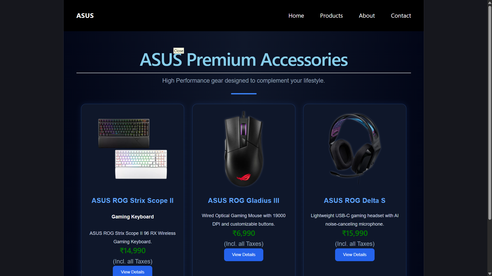

# ASUS Premium Store

A React + Vite website for showcasing ASUS premium laptops and gaming accessories. The project includes separate pages for the home/accessories section, product listing, about section, and contact form.

## Project Explanation

This project is a simple single-page React application built with Vite. It uses `react-router-dom` for page routing and displays ASUS product information using reusable React components.

The application contains:

- A top navigation bar with links text for Home, Products, About, and Contact.
- A Home page that presents ASUS premium accessories such as a keyboard, mouse, and headset.
- A Products page that lists ASUS laptops with images, descriptions, prices, and order buttons.
- An About page that explains ASUS brand values, warranty, delivery, and support.
- A Contact page with a contact form and store contact details.

## Tech Stack

- React
- Vite
- React Router DOM
- JavaScript
- CSS

## Folder Structure

```text
basics/
|-- public/
|   |-- asus.jpg
|   |-- delta.jpg
|   |-- gladius.jpg
|   |-- rog.jpg
|   |-- scope.jpg
|   |-- tuff.jpg
|   `-- vivobook.jpg
|-- src/
|   |-- components/
|   |   |-- About.jsx
|   |   |-- Contact.jsx
|   |   |-- Home.jsx
|   |   |-- Navbar.jsx
|   |   `-- Products.jsx
|   |-- App.jsx
|   |-- App.css
|   |-- index.css
|   `-- main.jsx
|-- index.html
|-- package.json
|-- package-lock.json
`-- vite.config.js
```

## Pages

Markdown
### Home Page

Route: `/home`

The Home page displays ASUS premium accessories, including product cards for gaming keyboard, mouse, and headset items.

#### Screenshot



### Products Page

Route: `/products`

The Products page displays ASUS laptop products such as ROG Strix, Zenbook, Vivobook, and TUF Gaming laptops.

Screenshot:


### About Page

Route: `/about`

The About page describes ASUS as a technology brand and highlights premium quality, innovation, customer support, warranty, delivery, and help services.

Screenshot:


### Contact Page

Route: `/contact`

The Contact page includes a contact form with fields for name, email, subject, and message. It also shows address, email, and phone details.

Screenshot:


## Installation

Follow these steps to run the project on your local computer.

### 1. Clone or Download the Project

If using Git:

```bash
git clone <your-repository-url>
cd basics
```

If the project is already downloaded, open the project folder:

```bash
cd basics
```

### 2. Install Dependencies

```bash
npm install
```

### 3. Start the Development Server

```bash
npm run dev
```

After running this command, Vite will show a local URL such as:

```text
http://localhost:5173/
```

Open the Home page at:

```text
http://localhost:5173/home
```

## Available Scripts

```bash
npm run dev
```

Starts the development server.

```bash
npm run build
```

Creates a production build.

```bash
npm run preview
```

Previews the production build locally.

```bash
npm run lint
```

Runs ESLint to check code quality.

## Screenshot Setup

Add screenshots to the `screenshots` folder with these names:

- `home-page.png`
- `products-page.png`
- `about-page.png`
- `contact-page.png`

After adding the images, the screenshot spaces in this README will display automatically.

## Notes

- The project currently uses routes for `/home`, `/products`, `/about`, and `/contact`.
- The root path `/` does not currently render a page unless a route is added for it.
- Product images are stored in the `public` folder and are referenced using paths like `/rog.jpg`.
